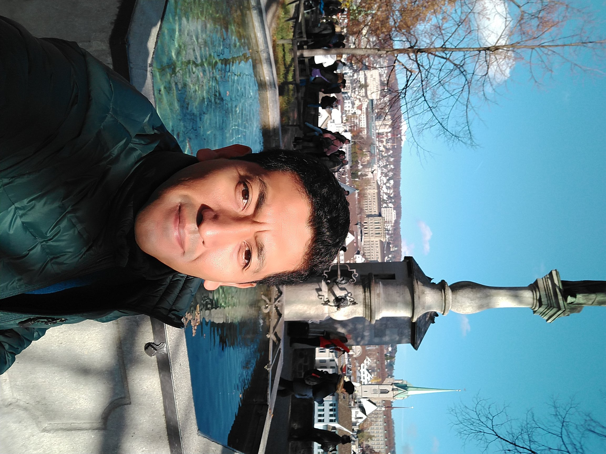

<link rel="stylesheet" href="styles.css" type="text/css">

# Research interest
My interest is the documentation of forest fire regime in pine-oak forests using dendrochronological analysis, as well the relationship between fire and climate. Besides, I started a tree-ring research along the Cordilleran in northeast Mexico.

I work at the [faculty of Forestry Sciences](http://www.fcf.uanl.mx/) in the Department of Silviculture. 

 
`r knitr::asis_output("\U1F393")` I graduated from the University of Göttingen in Germany at the [Faculty of Forest Sciences and Forest Ecology](https://uni-goettingen.de/en/19852.html) with a Doctor of Forestry Sciences (__Dr. forest.__) degree in 2005. 

My main three subject examinations  (Rigorosum) were: __Silviculture__, __Forest Growth__ and __Bioclimatologie__.

I am an avid [R enthusiast](https://rpubs.com/mgtagle-73) and a [Mendeley advisor](https://www.mendeley.com/profiles/marco-aurelio-gonzalez-tagle/). 

My full CV is available [here]().

